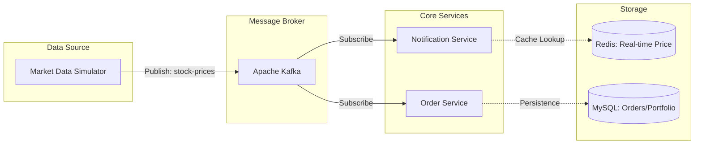
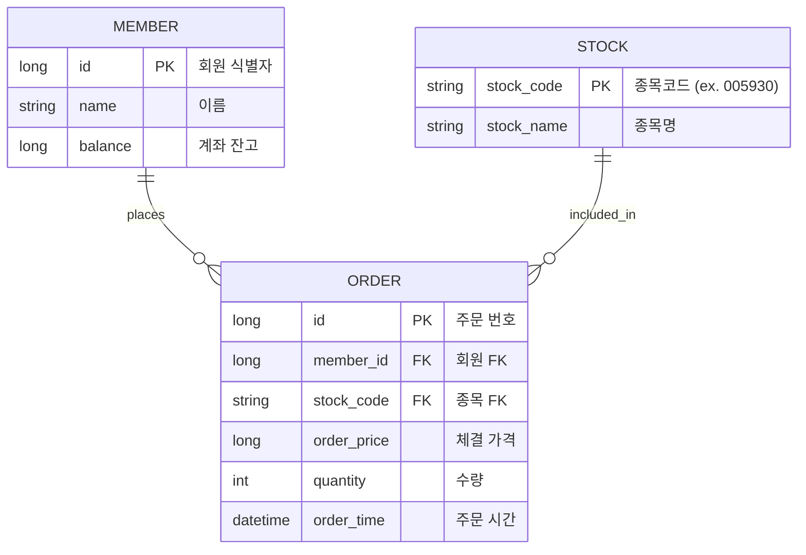

# stock-event-driven-simulator

이 프로젝트는 **Event-Driven Architecture**를 기반으로 실시간 데이터를 처리합니다.

## 🏗 System Architecture




## 🗄 Database Schema (ERD)




## 🚀 Why This Tech Stack?

실무에서 접해온 안정적인 레거시 환경을 넘어, 현대적인 기술 스택의 실제 효용성을 탐구하고 더 나은 서비스 경험을 제공하기 위한 기술적 시도를 담았습니다.

- **JPA**: 반복적인 SQL 작성을 지양하고, **도메인 중심 설계**와 **데이터 무결성** 확보를 위해 도입 (Dirty Checking, Lazy Loading 활용)
- **Redis**: 0.1초 단위의 **실시간 시세 데이터** 처리 시 발생하는 **RDB Disk I/O 병목**을 해결하기 위한 고성능 캐싱
- **Kafka**: 주문-알림 시스템 간의 강한 결합을 해제하고, **비동기 이벤트 처리**를 통한 시스템 확장성 및 장애 내구성 확보

---

## 🏗 Project Structure

```text
src/main/java/com/example/simulator
├── domain            # 비즈니스 핵심 로직 (Entity, Repository, Service)
│   ├── member        # 회원 및 자산 관리
│   ├── stock         # 종목 마스터 및 실시간 시세(Redis)
│   └── order         # 주문 체결 로직
├── global            # 공통 설정 및 예외 처리
│   └── config        # Redis, Kafka, JPA 설정
├── infra             # 인프라 연동 계층
│   └── kafka         # Kafka Producer / Consumer
└── web               # API Controller 및 DTO 
