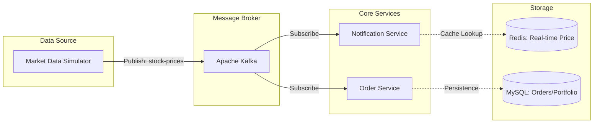

# stock-event-driven-simulator

이 프로젝트는 **Event-Driven Architecture**를 기반으로 실시간 데이터를 처리합니다.

## 🏗 System Architecture




## 🗄 Database Schema (ERD)

```mermaid
erDiagram
    USERS ||--o{ ORDERS : "places"
    USERS ||--o{ PORTFOLIOS : "owns"
    STOCKS ||--o{ ORDERS : "referenced"
    STOCKS ||--o{ PORTFOLIOS : "tracked"

    USERS {
        long id PK
        string email
        string nickname
    }
    STOCKS {
        string stock_code PK "e.g. 005930"
        string stock_name
    }
    ORDERS {
        long id PK
        long user_id FK
        string stock_code FK
        decimal price
        int quantity
        string status "PENDING, COMPLETED, CANCELLED"
        datetime created_at
    }
    PORTFOLIOS {
        long id PK
        long user_id FK
        string stock_code FK
        int total_quantity
        decimal average_price
    }
