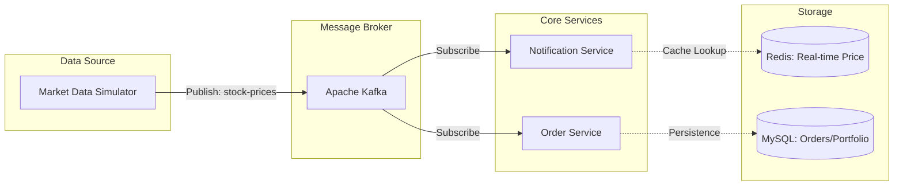

# stock-event-driven-simulator

이 프로젝트는 **Event-Driven Architecture**를 기반으로 실시간 데이터를 처리합니다.

## 🏗 System Architecture




## 🗄 Database Schema (ERD)

```mermaid
erDiagram
    MEMBER ||--o{ ORDER : "places"
    STOCK ||--o{ ORDER : "included_in"

    MEMBER {
        long id PK "회원 식별자"
        string name "이름"
        long balance "계좌 잔고"
    }

    STOCK {
        string stock_code PK "종목코드 (ex. 005930)"
        string stock_name "종목명"
    }

    ORDER {
        long id PK "주문 번호"
        long member_id FK "회원 FK"
        string stock_code FK "종목 FK"
        long order_price "체결 가격"
        int quantity "수량"
        datetime order_time "주문 시간"
    }
