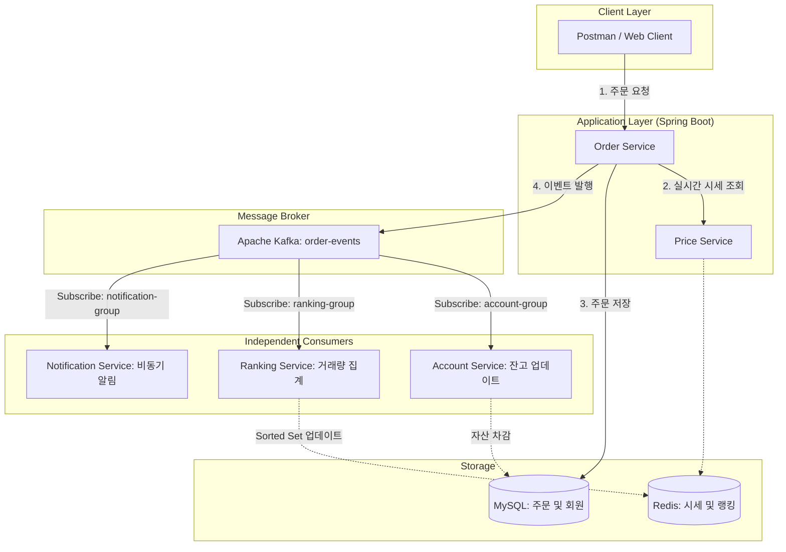
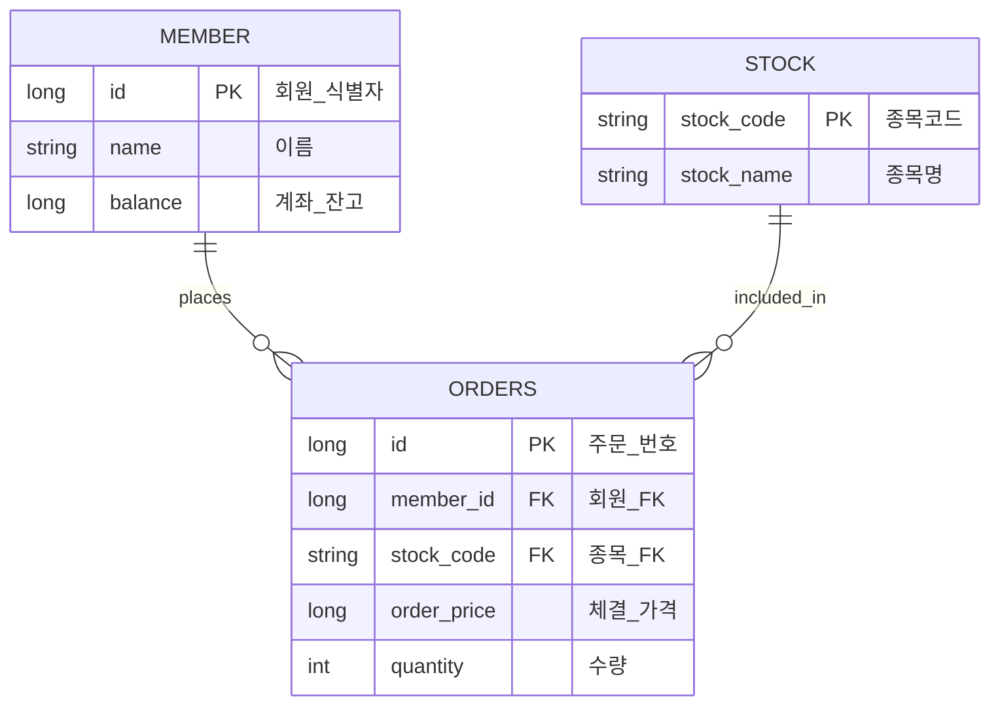

# 📈 Stock Event-Driven Simulator

이 프로젝트는 **Event-Driven Architecture(EDA)**를 기반으로 실시간 주식 시세 처리와 주문 시스템을 모사합니다. 실무에서 접해온 안정적인 레거시 환경을 넘어, 현대적인 백엔드 스택의 효용성을 탐구하고 서비스 간 결합도를 낮추는 설계를 목표로 했습니다.

---

## 🏗 System Architecture

현재 프로젝트는 주문 접수 후 다양한 후행 작업(자산 업데이트, 랭킹 집계, 알림)을 비동기로 처리하여 시스템의 응답성과 확장성을 극대화한 구조를 갖추고 있습니다.

```mermaid
graph TD
    subgraph "Client Layer"
        C[Postman / Web Client]
    end

    subgraph "Application Layer (Spring Boot)"
        OS[Order Service]
        PS[Price Service]
    end

    subgraph "Message Broker"
        K[Apache Kafka: order-events]
    end

    subgraph "Independent Consumers"
        AC[Account Service: 잔고 업데이트]
        RS[Ranking Service: 거래량 집계]
        NS[Notification Service: 비동기 알림]
    end

    subgraph "Storage"
        R[(Redis: 시세 및 랭킹)]
        DB[(MySQL: 주문 및 회원)]
    end

    C -->|1. 주문 요청| OS
    OS -->|2. 실시간 시세 조회| PS
    PS -.-> R
    OS -->|3. 주문 저장| DB
    OS -->|4. 이벤트 발행| K
    
    K -->|Subscribe: account-group| AC
    K -->|Subscribe: ranking-group| RS
    K -->|Subscribe: notification-group| NS
    
    AC -.->|자산 차감| DB
    RS -.->|Sorted Set 업데이트| R
```

---
## 🗄 Database Schema (ERD)

```mermaid
erDiagram
    MEMBER ||--o{ ORDERS : "places"
    STOCK ||--o{ ORDERS : "included_in"

    MEMBER {
        long id PK "회원_식별자"
        string name "이름"
        long balance "계좌_잔고"
    }

    STOCK {
        string stock_code PK "종목코드"
        string stock_name "종목명"
    }

    ORDERS {
        long id PK "주문_번호"
        long member_id FK "회원_FK"
        string stock_code FK "종목_FK"
        long order_price "체결_가격"
        int quantity "수량"
    }
```
    
---

## 🚀 Why This Tech Stack?

실무에서 접해온 안정적인 레거시 환경을 넘어, 현대적인 기술 스택이 실제 비즈니스 문제를 어떻게 해결할 수 있는지 탐구하고 시스템 확장성을 확보하기 위해 아래 기술들을 선정했습니다.

- **Spring Data JPA**: 반복적인 SQL 중심의 개발에서 벗어나 **도메인 중심 설계**를 가능하게 하며, 영속성 컨텍스트를 통한 **데이터 무결성** 확보를 위해 도입했습니다.
- **Redis (Sorted Set)**: 0.1초 단위의 **실시간 시세** 처리 시 발생하는 **RDB Disk I/O 병목**을 해결하고, 수만 건의 거래 데이터를 별도의 연산 없이 실시간으로 정렬하여 제공하기 위해 활용했습니다.
- **Apache Kafka**: 주문 접수와 후행 로직(자산 업데이트, 알림, 통계) 사이의 **강한 결합을 해제(Decoupling)**하고, 이벤트 기반의 **비동기 처리**를 통해 특정 서비스 장애가 전체 시스템으로 확산되는 것을 방지했습니다.

---

## ✅ Key Implementation Details

### 1. 실시간 거래량 랭킹 시스템 (Redis Sorted Set)
* **Problem**: RDB에서 `GROUP BY`와 `ORDER BY`를 사용해 거래량 순위를 조회하는 방식은 데이터가 누적될수록 인덱스 부하 및 쿼리 응답 시간 저하를 초래함.
* **Solution**: Redis의 `ZSetOperations`(`incrementScore`)를 활용해 주문 발생과 동시에 실시간으로 거래량을 누적 합산함. 랭킹 조회 시 별도의 집계 연산 없이 **O(log N)**의 속도로 상위 5개 종목을 즉시 반환하도록 최적화함.

### 2. 이벤트 기반 비동기 멀티 컨슈머 (Kafka)
* **Problem**: 주문 로직 내에 '카카오톡 알림'이나 '통계 업데이트'가 동기(Sync)로 묶여 있을 경우, 외부 API 지연이나 통계 서버 장애가 전체 주문 프로세스의 실패로 이어지는 위험이 있음.
* **Solution**: 하나의 주문 이벤트를 발행하고, 성격이 다른 3개의 서비스(Account, Ranking, Notification)가 각각 독립된 `Group ID`를 가진 컨슈머로서 메시지를 소비하도록 설계함. 이를 통해 전체 응답 속도를 향상시키고 **내결함성(Fault Tolerance)**을 확보함.

### 3. 로컬 개발 환경 자동화 (Docker & DataInitializer)
* **Problem**: 신규 개발 환경 구축 시 매번 수동으로 DB 스키마를 생성하고 기초 데이터를 입력해야 하는 번거로움 발생.
* **Solution**: `Docker Compose`를 통해 인프라 구축을 코드화하고, 스프링 부트 실행 시 `CommandLineRunner`를 활용하여 회원 정보, 종목 정보, Redis 실시간 시세를 자동으로 주입하도록 구현해 **'Run' 한 번으로 테스트가 가능한 환경**을 구축함.

---

## 1. Infrastructure 실행 (MySQL, Redis, Kafka)
docker-compose up -d

## 2. Application 실행
./gradlew bootRun
